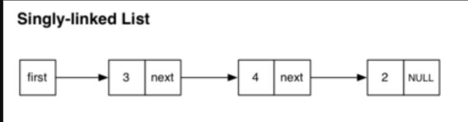
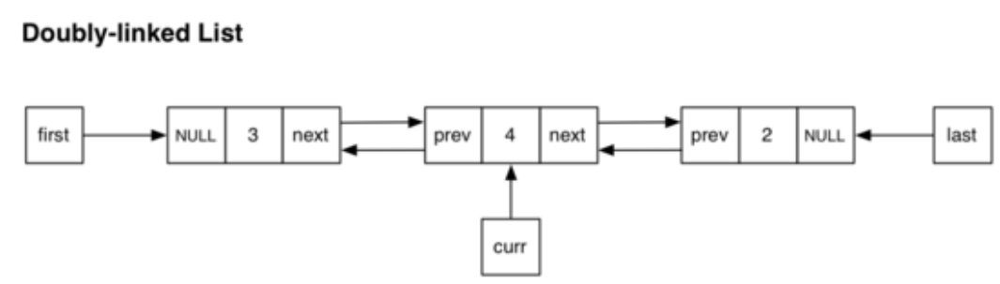
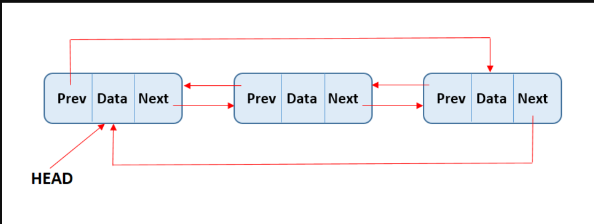
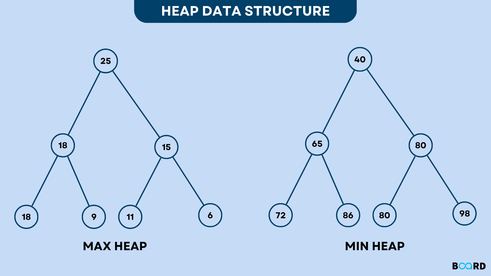
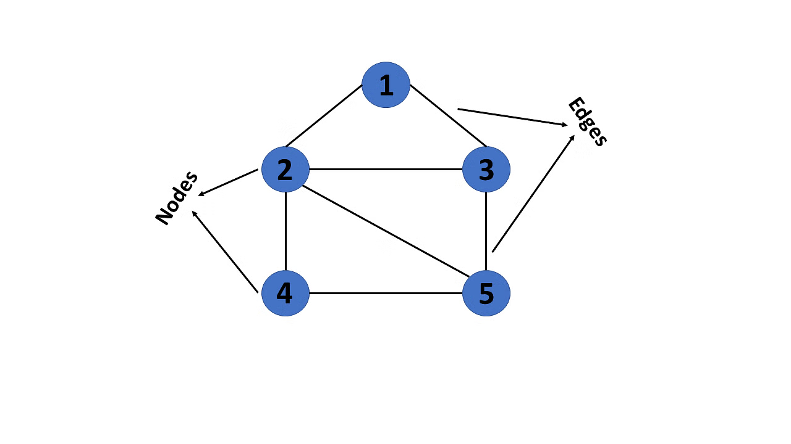
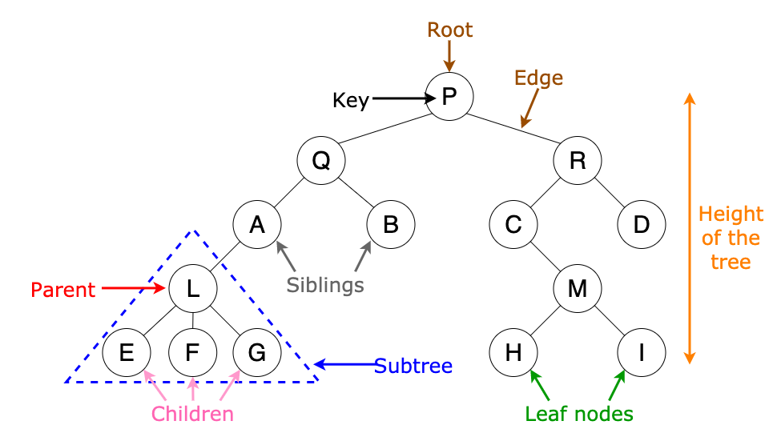

# Design_and_Analyze_Algorithms
 TP in DAA
 
 📍Demo link: https://drive.google.com/drive/folders/1s6YPdAonncG7ARhXE9im1FLMfexw1cCk?usp=sharing
 📍How to compile:
 
   Step 1: Installation. Install the following libraries before starting.
   
   Step 2: Install Python Extension.
   
   Step 3: Clone the repository.
   
   Step 4: Select Python file.
   
   Step 5: Select Python Interpreter.
   
   Step 6: Run the Python file.
 
**Data Structured covered:**
    LinkedList (Singly,Doubly,Cicular)
    Queues/Stack/Heap
    Graphs
    Trees

**Singly Linked list:**

A Singly Linked List is a data structure that consists of a sequence of elements called nodes. Each node contains:

Data: The actual value stored in the node.
Next: A pointer/reference to the next node in the sequence.
In a singly linked list, each node points only to the next node, and the last node's next reference is set to null.

**Advantages:**

Dynamic size: It can grow or shrink as needed without pre-allocating space.
Efficient insertion/deletion at the beginning or middle (compared to arrays).

**Disadvantages:**
No direct access to elements (sequential access).
More memory used because each node stores a pointer.

**Code Snippet:**

class Node:
    def __init__(self, data):
        self.data = data  # Data stored in the node
        self.next = None  # Pointer to the next node (initially None)

class SinglyLinkedList:
    def __init__(self):
        self.head = None  # Head of the list (initially None, empty list)

    def append(self, data):
        new_node = Node(data)  # Create a new node with the given data
        if not self.head:  # If the list is empty
            self.head = new_node  # The new node becomes the head
            return  # Exit the function

        last = self.head  # Start from the head to find the last node
        while last.next:  # Traverse the list until the next node is None
            last = last.next  # Move to the next node
        last.next = new_node  # The last node's next pointer points to the new node

    def display(self):
        current = self.head  # Start from the head
        while current:  # Traverse the list until the current node is None
            print(current.data, end=" -> ")  # Print the data of the current node
            current = current.next  # Move to the next node
        print("None")  # Print "None" to indicate the end of the list

linklist = SinglyLinkedList()

linklist.append("Fool")

linklist.append("Manila Bay")

linklist.append("Feel so good")

linklist.display()  # Output: Fool -> Manila Bay -> Feel so good -> None

**Use case:**

A song playlist, you can easily add or remove a song in the playlist. Each song points to the next one just like the output on the code.

 -----------------------------------------------------------------------------------------------------------------------------------------------------------------
**Doubly Linked List:**

A Doubly Linked List is a data structure similar to a singly linked list, but with an additional feature:

Each node contains two pointers:

Next: Points to the next node in the list.

Prev: Points to the previous node in the list.

This allows traversal in both directions (forward and backward).

**Advantages:**

Bidirectional traversal: Can easily traverse both forward and backward.

Efficient deletion/insertion: Easy to insert or delete nodes from both ends or in the middle, without needing to traverse the list.

**Disadvantages:**

Extra memory: Each node uses extra memory to store the Prev pointer.

Slightly more complex operations due to handling two pointers.

**Code snippet:**

class Node:
    def __init__(self, data):
        self.data = data      # Data stored in the node
        self.next = None      # Pointer to the next node (initially None)
        self.prev = None      # Pointer to the previous node (initially None)

class DoublyLinkedList:
    def __init__(self):
        self.head = None      # Head of the list (initially None)

    def append(self, data):
        new_node = Node(data)  # Create a new node
        if not self.head:      # If the list is empty
            self.head = new_node  # New node is both head and tail
            return

        last = self.head      # Start from the head to find the last node
        while last.next:      # Traverse until the next node is None
            last = last.next  # Move to the next node
        last.next = new_node  # Link the last node to the new node
        new_node.prev = last  # Link the new node back to the last node

    def prepend(self, data):
        new_node = Node(data)  # Create a new node
        new_node.next = self.head  # New node's next points to the current head
        if self.head:          # If the list is not empty
            self.head.prev = new_node  # Current head's prev points to the new node
        self.head = new_node      # New node becomes the new head

    def display(self):
        current = self.head      # Start from the head
        while current:          # Traverse until the current node is None
            print(current.data, end=" <-> ")  # Print the data
            current = current.next  # Move to the next node
        print("None")          # Mark the end of the list

    def display_reverse(self):
        if not self.head:
            return

        current = self.head      # Start from the head
        while current.next:      # Traverse to the end of the list
            current = current.next

        while current:          # Traverse backwards
            print(current.data, end=" <-> ")
            current = current.prev  # Move to the previous node
        print("None")          # Mark the end of the list

**Use case:**

A song or a playlist you can play the next song or the previous song. A web browser history you can go to the next url or the previous url.

-----------------------------------------------------------------------------------------------------------------------------------------------------------------

**Cirular Linked List**

A Circular Linked List is a variation of a linked list where:

The last node points back to the first node instead of having a null reference.

This creates a circular structure, where you can loop through the list continuously from any node.

Circular linked lists can be singly or doubly linked, depending on whether each node contains one or two pointers (next and/or prev).

**Advantages:**

Efficient circular traversal: You can easily traverse the list in a loop, which is useful in applications like round-robin scheduling.
No need for null pointers: The structure is self-referential, so no null pointers are required to mark the end.

Efficient for continuous operations: Especially useful for problems involving cycles or repeated operations.

**Disadvantages:**

Complexity: Slightly more complex to manage due to circular references.

Memory management: Can be tricky in cases of frequent insertion/deletion, especially when loops are involved.

**Code snippet:**

class Node:

    def __init__(self, data):
        self.data = data      # Data stored in the node
        self.next = None      # Pointer to the next node (initially None)

class CircularLinkedList:

    def __init__(self):
        self.head = None      # Head of the list (initially None)

    def append(self, data):
        new_node = Node(data)  # Create a new node
        if not self.head:      # If the list is empty
            self.head = new_node  # New node is the head
            new_node.next = self.head  # Make it circular (points to itself)
            return

        current = self.head      # Start from the head to find the last node
        while current.next != self.head:  # Traverse until we reach the last node
            current = current.next  # Move to the next node
        current.next = new_node  # Link the last node to the new node
        new_node.next = self.head  # Link the new node back to the head (circular)

    def display(self):
        if not self.head:
            return

        current = self.head      # Start from the head
        while True:              # Loop indefinitely (until we break)
            print(current.data, end=" -> ")  # Print the data
            current = current.next  # Move to the next node
            if current == self.head:  # Check if we've come back to the head
                break              # Exit the loop
        print("None")          # Mark the end (although it's circular)

# Example Usage (explained below):
cll = CircularLinkedList()

cll.append("Fool")

cll.append("Manila Bay")

cll.append("Feel so good")

cll.display()  # Output: Fool -> Manila Bay -> Feel so good -> None

# Explanation of the example usage:

# 1. cll = CircularLinkedList():
#    - Creates an empty circular linked list.  self.head is None.

# 2. cll.append("Fool"):
#    - Creates a new node with data "Fool".
#    - Since the list is empty, this node becomes the head.
#    - Crucially, its next pointer is set to itself, making it circular.

# 3. cll.append("Manila Bay"):
#    - Creates a new node with data "Manila Bay".
#    - The code traverses from the head ("Fool") to find the last node (which is currently "Fool" itself).
#    - The "Fool" node's next pointer is set to the "Manila Bay" node.
#    - The "Manila Bay" node's next pointer is set back to the head ("Fool"), completing the circle.

# 4. cll.append("Feel so good"):
#    - Creates a new node with data "Feel so good".
#    - The code traverses from the head ("Fool") until it finds the last node ("Manila Bay").
#    - The "Manila Bay" node's next pointer is set to the "Feel so good" node.
#    - The "Feel so good" node's next pointer is set back to the head ("Fool"), maintaining the circular structure.

# 5. cll.display():
#    - Starts at the head ("Fool").
#    - Prints the data and moves to the next node.
#    - Continues until it comes back to the head ("Fool") again.  This is how it knows it has traversed the entire circular list.

------------------------------------------------------------------------------------------------------------------------------------------------------------------

**Queue**

A Queue is a linear data structure that follows the First In, First Out (FIFO) principle. This means that the first element added to the queue will be the first one to be removed, similar to a queue in real life (like a line at a coffee shop).

**Advantages:**

Simple and efficient for managing sequential data.

Ensures fair processing with FIFO order.

Useful for handling tasks in various applications like IO buffering or task scheduling.

**Disadvantages:**

Limited access: Only the front element can be accessed directly.

Fixed size (in some implementations), which may require resizing or cause overflow.

**Code snippet:**

class Queue:

    def __init__(self):
        self.items = []  # Use a list to store queue elements

    def is_empty(self):
        return len(self.items) == 0

    def enqueue(self, item):
        self.items.append(item)  # Add to the rear (end)

    def dequeue(self):
        if not self.is_empty():
            return self.items.pop(0)  # Remove from the front (beginning)
        else:
            return None  # Or raise an exception

    def peek(self):
        if not self.is_empty():
            return self.items[0]  # Return the front element without removing it
        else:
            return None

    def size(self):
        return len(self.items)

    def view_queue(self):
        return self.items  # Return the queue as a list

# Example usage (explained below):

queue = Queue()

queue.enqueue(1)

queue.enqueue(2)

queue.enqueue(3)

print("Current queue:", queue.view_queue())  # Output: Current queue: [1, 2, 3]

print("Queue size:", queue.size())  # Output: Queue size: 3

print("Front element:", queue.peek())  # Output: Front element: 1

print("Dequeued element:", queue.dequeue())  # Output: Dequeued element: 1

print("Dequeued element:", queue.dequeue())  # Output: Dequeued element: 2

print("Is queue empty?", queue.is_empty())  # Output: Is queue empty? False

print("Dequeued element:", queue.dequeue())  # Output: Dequeued element: 3

print("Is queue empty?", queue.is_empty())  # Output: Is queue empty? True

print("Dequeued Element:", queue.dequeue())  # Output: Dequeued Element: None

# Explanation of the example usage:

# 1. queue = Queue():
#    - Creates an empty queue.  self.items is initialized as an empty list [].

# 2. queue.enqueue(1), queue.enqueue(2), queue.enqueue(3):
#    - Adds elements to the *rear* of the queue.
#    - The queue now looks like this: [1, 2, 3] (1 is at the front, 3 is at the rear).

# 3. print("Current queue:", queue.view_queue()):
#    - Prints the current state of the queue.

# 4. print("Queue size:", queue.size()):
#    - Prints the number of elements in the queue (3 at this point).

# 5. print("Front element:", queue.peek()):
#    - Prints the element at the front of the queue *without* removing it (1).

# 6. print("Dequeued element:", queue.dequeue()):
#    - Removes and returns the element at the *front* of the queue (1).
#    - The queue is now: [2, 3]

# 7. print("Dequeued element:", queue.dequeue()):
#    - Removes and returns the element at the front of the queue (2).
#    - The queue is now: [3]

# 8. print("Is queue empty?", queue.is_empty()):
#    - Checks if the queue is empty (it's not, it has one element).

# 9. print("Dequeued element:", queue.dequeue()):
#    - Removes and returns the element at the front of the queue (3).
#    - The queue is now empty: []

# 10. print("Is queue empty?", queue.is_empty()):
#     - Checks if the queue is empty (it is now).

# 11. print("Dequeued Element:", queue.dequeue()):
#     - Tries to dequeue from an empty queue.  Returns None.

**Use case:**

A line of people ordering in a coffee shop, The first one in the line will be the first one to order and get out of the line, if a new customer will order he/she needs to be at the end of  the line becoming the tail.

------------------------------------------------------------------------------------------------------------------------------------------------------------------

**Stack**

A Stack is a linear data structure that follows the Last In, First Out (LIFO) principle. This means the last element added to the stack is the first one to be removed, similar to a stack of plates where you take the top plate first.

**Advantages:**

Simple and efficient for operations like adding/removing from the top.

Useful for problems that need to track the order of operations in a reversible manner.

**Disadvantages:**

Limited access: You can only access the top element, not the ones below it.

Fixed size (in some implementations), leading to overflow when the stack is full.

**Code snippet:**

class Stack:

    def __init__(self):
        self.items = []  # Use a list to store stack elements

    def is_empty(self):
        return len(self.items) == 0

    def push(self, item):  # Corrected: parameter name should be 'item', not 'items'
        self.items.append(item)  # Add to the top

    def pop(self):
        if not self.is_empty():
            return self.items.pop()  # Remove and return the top element
        else:
            return None  # Or raise an exception

    def peek(self):
        if not self.is_empty():
            return self.items[-1]  # Return the top element without removing it
        else:
            return None

    def size(self):
        return len(self.items)

    def view_stack(self):
        return self.items  # Return the stack as a list

# Example usage (explained below):

stack = Stack()

stack.push(1)

stack.push(2)

stack.push(3)

print("Current Stack:", stack.view_stack())  # Output: Current Stack: [1, 2, 3]

print("Stack size:", stack.size())  # Output: Stack size: 3

print("Top element:", stack.peek())  # Output: Top element: 3

print("Popped element:", stack.pop())  # Output: Popped element: 3

print("Popped element:", stack.pop())  # Output: Popped element: 2

print("Is stack empty?", stack.is_empty())  # Output: Is stack empty? False

print("Popped element:", stack.pop())  # Output: Popped element: 1

print("Is stack empty?", stack.is_empty())  # Output: Is stack empty? True

print("Popped element:", stack.pop())  # Output: Popped element: None

# Explanation of the example usage:

# 1. stack = Stack():
#    - Creates an empty stack. self.items is initialized as an empty list [].

# 2. stack.push(1), stack.push(2), stack.push(3):
#    - Adds elements to the *top* of the stack.
#    - The stack now looks like this: [1, 2, 3] (3 is at the top).

# 3. print("Current Stack:", stack.view_stack()):
#    - Prints the current state of the stack.

# 4. print("Stack size:", stack.size()):
#    - Prints the number of elements in the stack (3 at this point).

# 5. print("Top element:", stack.peek()):
#    - Prints the element at the top of the stack *without* removing it (3).

# 6. print("Popped element:", stack.pop()):
#    - Removes and returns the element at the *top* of the stack (3).
#    - The stack is now: [1, 2]

# 7. print("Popped element:", stack.pop()):
#    - Removes and returns the element at the top of the stack (2).
#    - The stack is now: [1]

# 8. print("Is stack empty?", stack.is_empty()):
#    - Checks if the stack is empty (it's not, it has one element).

# 9. print("Popped element:", stack.pop()):
#    - Removes and returns the element at the top of the stack (1).
#    - The stack is now empty: []

# 10. print("Is stack empty?", stack.is_empty()):
#     - Checks if the stack is empty (it is now).

# 11. print("Popped element:", stack.pop()):
#     - Tries to pop from an empty stack. Returns None.

**Use case:**

A stack of books, to get the book at the bottom, you need to remove the books at the top first, otherwise the stack will collapse.

------------------------------------------------------------------------------------------------------------------------------------------------------------------

**Heap**

A Heap is a special type of binary tree that satisfies the heap property. There are two main types of heaps:

Max Heap: The value of each node is greater than or equal to the values of its children. The largest value is at the root.

Min Heap: The value of each node is less than or equal to the values of its children. The smallest value is at the root.

**Advantages:**

Efficient Insertion and Deletion: Insertion and deletion (extracting max or min) are done in O(log n) time.

Balanced Structure: As a complete binary tree, heaps are balanced, ensuring efficient operations.

**Disadvantages:**

Not Efficient for Search: Searching for arbitrary elements is O(n) since there’s no ordering for arbitrary nodes.

Limited Access: Only the root node can be accessed directly; other elements require traversal.

**Code snippet:**

import heapq

class MinHeap:

    def __init__(self):
        self.heap = []  # Use a list to store heap elements

    def push(self, item):
        heapq.heappush(self.heap, item)  # Add to the heap, maintaining heap property

    def pop(self):
        if self.heap:
            return heapq.heappop(self.heap)  # Remove and return the smallest item
        else:
            return None  # Or raise an exception

    def peek(self):
        if self.heap:
            return self.heap[0]  # Return the smallest item (root)
        else:
            return None

    def size(self):
        return len(self.heap)

    def is_empty(self):
        return len(self.heap) == 0

# Example usage (explained below):

min_heap = MinHeap()

min_heap.push(5)

min_heap.push(1)

min_heap.push(9)

min_heap.push(2)

print("Heap size:", min_heap.size())       # Output: Heap size: 4

print("Smallest element:", min_heap.peek())  # Output: Smallest element: 1

print("Is heap empty?", min_heap.is_empty())  # Output: Is heap empty? False

print("Popped element:", min_heap.pop())     # Output: Popped element: 1

print("Popped element:", min_heap.pop())     # Output: Popped element: 2

print("Is heap empty?", min_heap.is_empty())  # Output: Is heap empty? False

print("Popped element:", min_heap.pop())     # Output: Popped element: 5

# Explanation of the example usage:

# 1. min_heap = MinHeap():
#    - Creates an empty min-heap. self.heap is initialized as [].

# 2. min_heap.push(5), min_heap.push(1), min_heap.push(9), min_heap.push(2):
#    - Adds elements to the heap.  The `heapq.heappush()` function ensures that the heap property is maintained.
#    - After these pushes, the heap (self.heap) conceptually looks like this (the actual list representation might be slightly different due to the heap structure):
#
#          1
#        /   \
#       2     9
#      /
#     5

# 3. print("Heap size:", min_heap.size()):
#    - Prints the number of elements in the heap (4).

# 4. print("Smallest element:", min_heap.peek()):
#    - Prints the smallest element (the root), which is 1.

# 5. print("Is heap empty?", min_heap.is_empty()):
#    - Checks if the heap is empty (it's not).

# 6. print("Popped element:", min_heap.pop()):
#    - Removes and returns the smallest element (1).
#    - The heap is now:
#
#          2
#        /   \
#       5     9

# 7. print("Popped element:", min_heap.pop()):
#    - Removes and returns the smallest element (2).
#    - The heap is now:
#
#          5
#           \
#            9

# 8. print("Is heap empty?", min_heap.is_empty()):
#    - Checks if the heap is empty (it's not).

# 9. print("Popped element:", min_heap.pop()):
#    - Removes and returns the smallest element (5).
#    - The heap is now:
#
#          9

# ... (and so on)
------------------------------------------------------------------------------------------------------------------------------------------------------------------

**Graph**

A Graph is a non-linear data structure used to represent relationships between objects. It consists of:

Vertices (Nodes): The entities or points in the graph.

Edges (Links): The connections between the vertices.

Graphs can represent complex structures like social networks, transportation systems, or computer networks.

**Advantages:**

Versatile Representation: Graphs can model a wide variety of real-world systems.

Efficient Search: Algorithms like BFS and DFS allow quick searches and analysis of graph structures.

**Disadvantages:**

Complexity: Graphs can become complex and difficult to manage with many vertices and edges.

Memory Usage: Representing large graphs can require significant memory (especially with adjacency matrices).

**Code snippet:**

class Graph:

    def __init__(self, adjacency_list=None):  # Corrected typo: adjency_list to adjacency_list
        if adjacency_list is None:
            self.adjacency_list = {}  # Dictionary to store adjacency list
        else:
            self.adjacency_list = adjacency_list

    def add_vertex(self, vertex):
        if vertex not in self.adjacency_list:
            self.adjacency_list[vertex] = []  # Initialize empty list of neighbors

    def add_edge(self, vertex1, vertex2):
        self.adjacency_list[vertex1].append(vertex2)  # Add directed edge from vertex1 to vertex2
        # For an undirected graph, add the reverse edge as well:
        # self.adjacency_list[vertex2].append(vertex1)  # If the graph is undirected

    def get_neighbors(self, vertex):
        return self.adjacency_list.get(vertex, [])  # Return empty list if no neighbors

    def print_graph(self):
        for vertex in self.adjacency_list:
            neighbors = ", ".join(map(str, self.adjacency_list[vertex]))  # Convert neighbors to strings
            print(f"{vertex}: {neighbors}")

# Example usage (explained below):

graph = Graph()

graph.add_vertex("Spongebob")

graph.add_vertex("Patrick")

graph.add_vertex("Squidward")

graph.add_edge("Spongebob", "Patrick")

graph.add_edge("Spongebob", "Squidward")

graph.add_edge("Patrick", "Squidward")

graph.print_graph()

# Output:
# Spongebob: Patrick, Squidward
# Patrick: Squidward
# Squidward: 

print(graph.get_neighbors("Spongebob"))  # Output: ['Patrick', 'Squidward']

print(graph.get_neighbors("Plankton"))  # Output: [] (empty list, no neighbors)

# Explanation of the example usage:

# 1. graph = Graph():
#    - Creates an empty graph object.  self.adjacency_list is initialized as an empty dictionary {}.

# 2. graph.add_vertex("Spongebob"), graph.add_vertex("Patrick"), graph.add_vertex("Squidward"):
#    - Adds the vertices "Spongebob", "Patrick", and "Squidward" to the graph.
#    - The adjacency list now looks like this:
#      {
#          "Spongebob": [],
#          "Patrick": [],
#          "Squidward": []
#      }

# 3. graph.add_edge("Spongebob", "Patrick"):
#    - Adds a directed edge from "Spongebob" to "Patrick".
#    - The adjacency list becomes:
#      {
#          "Spongebob": ["Patrick"],
#          "Patrick": [],
#          "Squidward": []
#      }

# 4. graph.add_edge("Spongebob", "Squidward"):
#    - Adds a directed edge from "Spongebob" to "Squidward".
#    - The adjacency list becomes:
#      {
#          "Spongebob": ["Patrick", "Squidward"],
#          "Patrick": [],
#          "Squidward": []
#      }

# 5. graph.add_edge("Patrick", "Squidward"):
#    - Adds a directed edge from "Patrick" to "Squidward".
#    - The adjacency list becomes:
#      {
#          "Spongebob": ["Patrick", "Squidward"],
#          "Patrick": ["Squidward"],
#          "Squidward": []
#      }

# 6. graph.print_graph():
#    - Prints the adjacency list in a readable format.

# 7. print(graph.get_neighbors("Spongebob")):
#    - Returns the list of neighbors of "Spongebob": ['Patrick', 'Squidward']

# 8. print(graph.get_neighbors("Plankton")):
#    - Returns an empty list [] because "Plankton" is not in the graph.
------------------------------------------------------------------------------------------------------------------------------------------------------------------
**Tree**

A Tree is a hierarchical data structure that consists of nodes connected by edges. It is used to represent hierarchical relationships, such as file systems, organization charts, or decision-making processes.

**Basic Components of a Tree:**

**Node:** An individual element in the tree that holds data.

**Root:** The top node of the tree, from which all other nodes are descendants.

**Parent:** A node that has one or more children.

**Child:** A node that is a descendant of another node (parent).

**Leaf:** A node with no children (end node).

**Edge:** The connection between two nodes.

**Subtree:** A tree formed by a node and its descendants.

**Advantages:**

Efficient Search and Sort: Operations like search, insertion, and deletion are efficient, especially in balanced trees.

Hierarchical Representation: Ideal for modeling hierarchical structures.

Flexibility: Trees can represent a wide range of problems, from file systems to decision-making processes.

**Disadvantages:**

Complexity: Trees can be complex to implement and manage, especially when balancing is required.

Memory Usage: Storing trees can require more memory than simpler data structures like arrays or lists.

**Code snippet:**

class TreeNode:

    def __init__(self, data):
        self.data = data      # Data stored in the node
        self.children = []  # List to store child nodes (initially empty)

    def add_child(self, child):
        self.children.append(child)  # Add a child node to this node

    def __str__(self):  # For easy printing of node data
        return str(self.data)

def print_tree(node, level=0):

    print("  " * level + str(node.data))  # Print node data with indentation
    for child in node.children:  # Recursively print each child's subtree
        print_tree(child, level + 1)  # Increase indentation level for children

# Example usage (explained below):

root = TreeNode("Electronics")  # Create the root node

laptop = TreeNode("Laptop")  # Create a Laptop node

phone = TreeNode("Phone")    # Create a Phone node

tv = TreeNode("TV")        # Create a TV node

root.add_child(laptop)  # Add Laptop as a child of Electronics

root.add_child(phone)    # Add Phone as a child of Electronics

root.add_child(tv)        # Add TV as a child of Electronics

dell = TreeNode("Dell")    # Create a Dell node

hp = TreeNode("HP")      # Create an HP node

laptop.add_child(dell)  # Add Dell as a child of Laptop

laptop.add_child(hp)    # Add HP as a child of Laptop

iphone = TreeNode("Iphone")  # Create an Iphone node

android = TreeNode("Android")  # Create an Android node

phone.add_child(iphone)  # Add Iphone as a child of Phone

phone.add_child(android)  # Add Android as a child of Phone

samsung = TreeNode("Samsung")  # Create a Samsung node

lg = TreeNode("LG")      # Create an LG node

tv.add_child(samsung)    # Add Samsung as a child of TV

tv.add_child(lg)        # Add LG as a child of TV

print_tree(root)  # Print the entire tree structure

# Explanation of the example usage:

# 1. root = TreeNode("Electronics"):
#    - Creates the root node of the tree with data "Electronics".
#    - This is the top-most node.

# 2. laptop = TreeNode("Laptop"), phone = TreeNode("Phone"), tv = TreeNode("TV"):
#    - Creates three nodes: "Laptop", "Phone", and "TV".  These are initially separate nodes.

# 3. root.add_child(laptop), root.add_child(phone), root.add_child(tv):
#    - Makes "Laptop", "Phone", and "TV" *children* of the "Electronics" node.
#    - Now, "Electronics" is the parent of these three nodes.

# 4. dell = TreeNode("Dell"), hp = TreeNode("HP"), laptop.add_child(dell), laptop.add_child(hp):
#    - Creates "Dell" and "HP" nodes and makes them children of "Laptop".

# 5. iphone = TreeNode("Iphone"), android = TreeNode("Android"), phone.add_child(iphone), phone.add_child(android):
#    - Creates "Iphone" and "Android" nodes and makes them children of "Phone".

# 6. samsung = TreeNode("Samsung"), lg = TreeNode("LG"), tv.add_child(samsung), tv.add_child(lg):
#    - Creates "Samsung" and "LG" nodes and makes them children of "TV".

# 7. print_tree(root):
#    - Calls the `print_tree` function to display the tree structure.
#    - The `print_tree` function recursively traverses the tree, printing each node's data with appropriate indentation to show the hierarchy.
